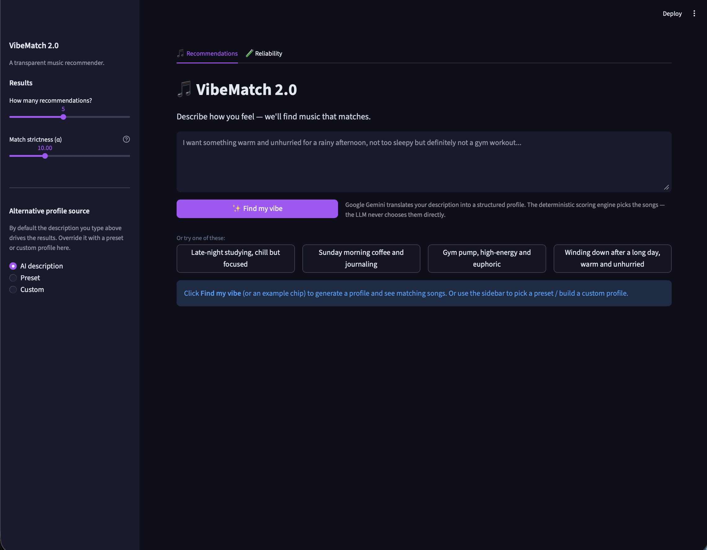
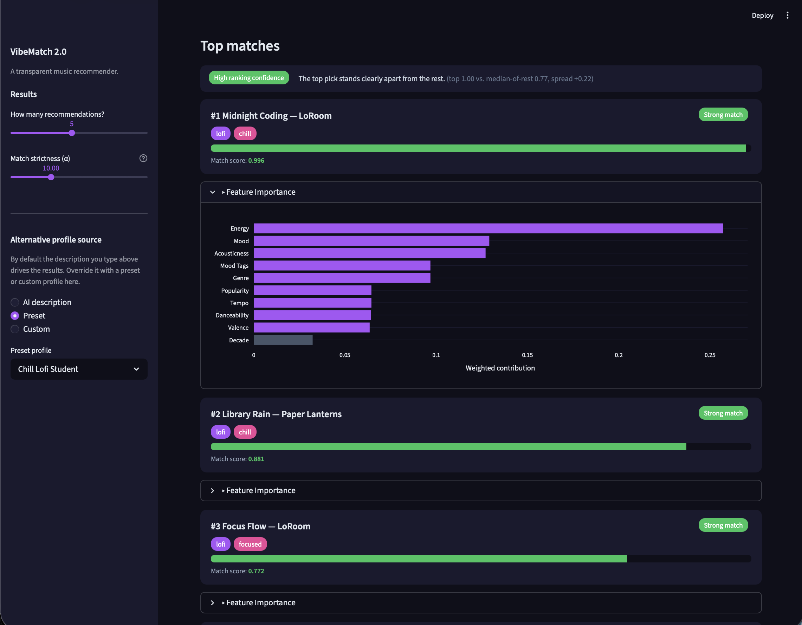
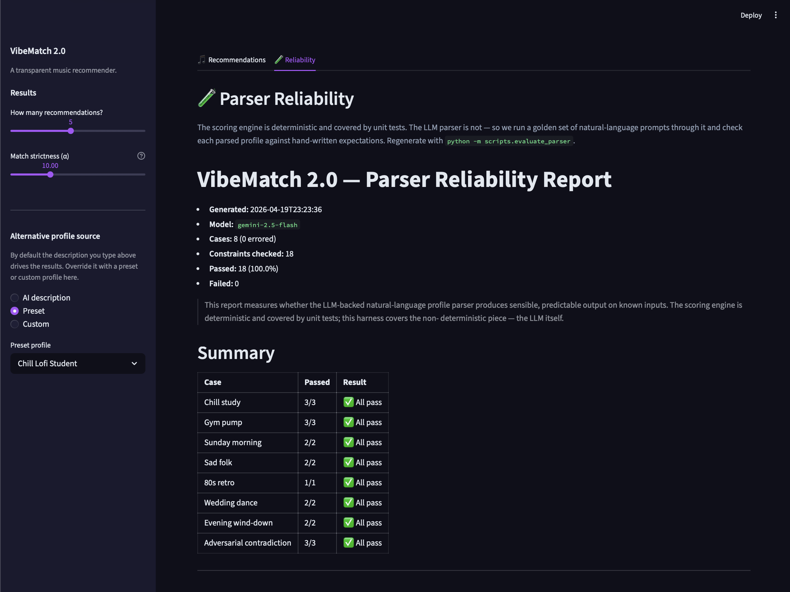

# 🎵 VibeMatch 2.0 - A Transparent Music Recommender

VibeMatch 2.0 is a content-based music recommender where a user describes how they feel in plain English and gets back ranked songs with a visible, auditable reason for every score. A Google Gemini LLM translates the description into a structured taste profile, a deterministic Gaussian-decay scoring engine ranks the catalog, and a Streamlit dashboard surfaces per-feature importance charts plus the LLM's own rationale. The responsible-AI design principle throughout: **the LLM is the front door, not the decision-maker**, so every ranking decision stays in code you can read.



---

## Original Project: VibeMatch 1.0

VibeMatch 2.0 extends **VibeMatch 1.0**, the content-based music recommender I built for **AI110 Module 3** (*Music Recommender Simulation*). The original was a command-line tool backed by a 20-song CSV catalog, a weighted Gaussian-decay scoring engine combining categorical matches (genre, mood) with numeric features (energy, valence, danceability, acousticness, tempo), and seven hand-crafted user profiles (four realistic, three adversarial) used to probe the scoring logic. The starter also shipped with a model card documenting known catalog limitations. In particular, a severe density imbalance (lofi has three songs; most other genres have one) that the model card called out directly:

> *"A system can look like it's working when it's really just defaulting to whatever the data has the most of."*

The 2.0 extension was shaped by that limitation: the goal was to make the system's reasoning legible to the user so they could see **why** a recommendation won, not just *that* it won.

---

## What's New in 2.0

- **Streamlit dashboard** replacing the CLI, with the natural-language input as the hero feature
- **Per-feature importance charts** (Plotly) that decompose every score into weighted contributions. Users hover to see exactly which features earned a song its ranking.
- **Natural-language profile builder** powered by Google Gemini 2.5 Flash with schema-constrained JSON output, so "I want something warm and unhurried" becomes a structured `UserProfile` the deterministic scorer can consume
- **Confidence signals** on every result card (*Strong / Moderate / Weak*) plus a *Ranking confidence* summary above the top-k based on how tightly clustered the scores are
- **LLM evaluation harness** (`scripts/evaluate_parser.py`) that runs a hand-written golden set through live Gemini, checks each parsed profile against assertions, and writes a markdown report at [assets/reliability_report.md](assets/reliability_report.md)
- **Reliability tab** in the dashboard that embeds the latest report inline, so the evidence lives next to the feature and not buried in a repo

---

## Architecture Overview


The system is organized as a pipeline of six components with explicit verification at each boundary:

1. **User Input** - three paths (natural-language description, preset profile, or custom sliders). The NL path is the default hero experience.
2. **LLM Agent (Gemini 2.5 Flash)** - reads natural language and emits a structured `UserProfile` JSON via schema-constrained output. Genre / mood / mood-tag values are restricted to `enum` lists pulled from the catalog so the model can't invent a genre that doesn't exist. Returns a plain-English rationale alongside the profile.
3. **Deterministic Scoring Engine** - the same Gaussian-decay and weighted categorical logic from VibeMatch 1.0. Every ranking decision happens here, not in the LLM.
4. **Explainability Layer** - decomposes every score into ten per-feature weighted contributions for the charts, raises a low-confidence warning when `top_score < 0.45`, and surfaces the LLM's rationale for user review.
5. **Streamlit Dashboard** - hero NL input, result cards with gradient score bars and confidence badges, feature-importance expanders, and a Reliability tab embedding the evaluation report.
6. **Human-in-the-Loop** - the user reviews the "How Gemini read you" panel *before* trusting the results and can always override the LLM by switching to a preset or custom profile.

A deeper Mermaid-rendered diagram with tables describing every verification point lives at [assets/system_diagram.md](assets/system_diagram.md). The scoring-pipeline detail from the starter project is preserved at [assets/flowchart.md](assets/flowchart.md).

---

## Setup Instructions

### Prerequisites

- Python 3.10 or later
- A free Google Gemini API key from [aistudio.google.com/apikey](https://aistudio.google.com/apikey). Free tier is **5 requests per minute** for `gemini-2.5-flash`, which is plenty for demo usage but worth knowing.

### Install and run

```bash
# Clone the repo
git clone https://github.com/Ammugera/andrewmuriithi-applied-ai-system-project
cd andrewmuriithi-applied-ai-system-project

# Create an isolated environment
python -m venv venv
source venv/bin/activate     # Windows: venv\Scripts\activate

# Install dependencies
pip install -r requirements.txt

# Add your Gemini API key
cp .env.example .env
# Open .env and paste your key after GEMINI_API_KEY=

# Launch the dashboard
streamlit run src/app.py
```

The dashboard opens at [http://localhost:8501](http://localhost:8501).

### What happens without an API key?

If `GEMINI_API_KEY` is missing, the natural-language input is gracefully disabled with an explanatory message, and the **Preset** and **Custom** profile sources in the sidebar continue to work. The dashboard never crashes on a missing key. This is one of the intentional reliability properties.

### Alternate entry points

```bash
# Classic CLI runner (the original VibeMatch 1.0 interface, preserved)
python -m src.main

# Run the unit test suite (12 tests; no live API calls, safe for CI)
pytest tests/ -v

# Regenerate the reliability report by running the golden-set harness
# against live Gemini (takes ~2 minutes due to 5-RPM pacing)
python -m scripts.evaluate_parser
```

---

## Sample Interactions

Every example below is real output from Gemini 2.5 Flash on the live API, excerpted verbatim from [assets/reliability_report.md](assets/reliability_report.md), which contains all eight golden-set cases with pass/fail per constraint.



### Example 1 - Straightforward mapping

**Input:**

> *"Sunday morning coffee and journaling, slow and acoustic"*

**Parsed profile:**

| Field | Value |
|---|---|
| favorite_genre | `folk` |
| favorite_mood | `peaceful` |
| target_energy | `0.25` |
| target_acousticness | `0.95` |
| target_valence | `0.75` |
| target_decade | `2020` |

**Gemini's rationale:**

> *"The description 'Sunday morning coffee and journaling, slow and acoustic' strongly suggests a peaceful and relaxed mood. I've set high acousticness and low energy/danceability to match the 'slow and acoustic' preference. The preferred mood tags reflect the calm and introspective nature of journaling."*

The model extracted the obvious cues (*slow*, *acoustic*) and made them extreme (`acousticness = 0.95`, `energy = 0.25`) while keeping `valence` positive. The result reads as a relaxed *morning* vibe, not a sad one.

---

### Example 2 - Nuanced interpretation

**Input:**

> *"calm but not sleepy, an evening wind-down after work"*

**Parsed profile:**

| Field | Value |
|---|---|
| favorite_genre | `lofi` |
| favorite_mood | `relaxed` |
| target_energy | `0.45` |
| target_acousticness | `0.60` |
| target_valence | `0.65` |
| target_decade | `2020` |

**Gemini's rationale:**

> *"The request for 'calm but not sleepy' suggests a relaxed, low-energy vibe that isn't completely static, leading to a moderate energy and danceability. 'Evening wind-down' points to a peaceful and mellow mood, with a slightly positive valence. Lofi is a suitable genre for this specific combination of traits."*

This one required the model to thread a needle: *calm* pushes energy down, *not sleepy* pushes it back up. Gemini landed at `0.45` (low but not near zero) and explained the trade-off in the rationale. This is exactly the kind of response the "LLM as translator" design is meant to produce.

---

### Example 3 - Adversarial contradiction

**Input:**

> *"I want something both extremely calm and extremely loud at the same time"*

**Parsed profile:**

| Field | Value |
|---|---|
| favorite_genre | `ambient` |
| favorite_mood | `peaceful` |
| target_energy | `0.25` |
| target_valence | `0.55` |
| target_acousticness | `0.30` |

**Gemini's rationale:**

> *"The request for 'extremely calm and extremely loud' presents a contradiction. I've interpreted 'calm' as low energy and peaceful, while 'loud' is understood as a full, immersive soundscape that can be experienced at high volume, rather than high energy or aggression. Ambient music is chosen as it can provide a serene atmosphere with rich, expansive sound textures."*

Given a deliberately contradictory prompt, the model didn't return garbage or split the difference at `0.5` across every field. It explicitly named the contradiction, made a defensible trade-off (*calm* = low energy, *loud* = rich soundscape rather than aggression), and picked a genre whose canonical interpretation matches that reconciliation. This is what the reliability harness was built to verify.

> See [assets/reliability_report.md](assets/reliability_report.md) for all 8 golden-set cases with pass/fail per constraint.

---

## Design Decisions

Every major architectural choice in VibeMatch 2.0 traded something off. Here are the ones worth a recruiter's time:

**LLM as translator, not decision-maker.** I deliberately scoped Gemini to a single job (turning natural language into a structured `UserProfile`) and kept every ranking decision in deterministic code. This makes every recommendation explainable and reproducible. The trade-off: the system can't do open-ended reasoning about music the way a pure-LLM approach could. I judged that auditability was worth more than flexibility for a system that's supposed to *show its work*.

**Schema-constrained structured output with enum grounding.** The JSON schema passed to Gemini constrains `favorite_genre`, `favorite_mood`, and `preferred_mood_tags` to `enum` lists drawn from the catalog at import time, so the model literally can't hallucinate a genre that doesn't exist. Trade-off: Gemini's current Schema type doesn't support integer enums cleanly, so `target_decade` is validated via a system-prompt instruction plus a runtime check rather than a hard enum constraint.

**Post-hoc numeric clamping with `warnings.warn`.** Numeric fields (`target_energy`, `target_tempo_bpm`, etc.) are clamped to valid ranges after parsing, and every clamp emits a `UserWarning`. Trade-off: clamping silently adjusts the profile, but surfacing a warning lets us log or display the adjustment rather than hiding it.

**Plotly over matplotlib.** Plotly renders interactive bar charts with hover tooltips inside Streamlit, which sells the XAI story: users can hover over "Energy" and see `0.253 pts (weight 4.0 × raw 0.98 / 15.5)`. Trade-off: one extra dependency and slightly heavier page load compared to static matplotlib.

**Gemini 2.5 Flash over OpenAI or Claude.** Gemini is the only major LLM provider with a genuinely free tier that supports structured JSON output. Trade-off: the free tier is capped at **5 RPM**, which pushed the reliability harness to pace calls at 13-second intervals. For a demo or class project this is fine; for production it would mean moving to a paid tier or queuing requests.

**Golden-set assertion harness over LLM-as-judge evaluation.** The reliability harness (`scripts/evaluate_parser.py`) checks hand-written, falsifiable assertions (*"target_energy must be < 0.55 for the 'chill study' case"*) rather than using a second LLM to grade the first. Trade-off: the harness only tests what you explicitly assert, so subtler quality properties like tone, creativity, or naturalness of the rationale are invisible to it. But it's cheap, fast, and the assertions are themselves documentation of what "good" means.

---

## Testing Summary

### What worked

- **12/12 unit tests pass** in under a second. Eight cover the scoring engine (including `test_feature_weights_sum_to_total`, an invariant stating that the per-feature weighted contributions on any chart must sum to the displayed total score). Four cover the LLM parser using `unittest.mock.patch`, so they run in CI without hitting the real API or needing a key. See [tests/test_recommender.py](tests/test_recommender.py) and [tests/test_profile_parser.py](tests/test_profile_parser.py).
- **18/18 reliability constraints pass** on the 8-case golden set against live Gemini. Generated report: [assets/reliability_report.md](assets/reliability_report.md).
- **Streamlit startup is clean:** no tracebacks, `HTTP 200` on smoke tests, feature importance charts render correctly across all 7 preset profiles and a range of natural-language inputs.

### What didn't work on the first try

- **Import-path mismatch between agents.** When two sub-agents built `src/app.py` and `src/profile_parser.py` in parallel, one used `from profiles import ...` (which works because `streamlit run src/app.py` puts `src/` on `sys.path`) and the other used `from src.profiles import ...` (which requires the repo root on `sys.path`). The app imported fine but broke the moment the user clicked "Find my vibe" and triggered a lazy parser import. Fixed by prepending the repo root to `sys.path` at the top of `app.py` and normalizing to `from src.*` imports throughout.
- **Gemini free-tier rate limit turned out to be 5 RPM, not 15.** My first reliability-harness run called Gemini 8 times in rapid succession; calls 7 and 8 came back `429 RESOURCE_EXHAUSTED`. Fixed with a 13-second sleep between calls, which still keeps a full golden-set run under ~2 minutes.
- **The "80s retro synthwave" golden-set case failed on the first live run.** The catalog's `KNOWN_DECADES` enum is `[1990, 2000, 2010, 2020]`, so there is no 1980. Forced to pick from that list, Gemini chose 2010 and correctly reasoned about *"synthwave's resurgence"* in its rationale. My test was too strict. I relaxed the assertion to `target_decade <= 2010`, which matches the catalog's reality. This was a real **catalog-bias finding surfaced by the harness**, a class of issue the unit tests would never have caught.

### What I learned

- **An LLM evaluation harness pays for itself on the first run.** Mine caught a legitimate catalog-bias issue that unit tests missed, and it took about two hours to build. That ratio is compelling.
- **Integration smoke tests catch more classes of bug than any single unit test.** Running the dashboard end-to-end and hitting it with `curl` uncovered the import-path mismatch that passed every unit test.
- **LLM rate limits deserve first-class design consideration.** Free-tier capacity planning matters even for demos, because burst usage in the dashboard could easily trip a quota that a careful harness pacing strategy avoids.

---

## Reflection

VibeMatch 2.0 shows how I approach AI engineering. I started with a plain command line music recommender I built for AI110 Module 3 and asked what would make it trustworthy to use, not just functional. Adapting it meant adding a Streamlit dashboard, feature importance charts that explain every score, and a Gemini powered natural language profile builder. The decision I'm proudest of is keeping the LLM as a translator rather than a decision maker, so the ranking stays deterministic and auditable. I think that says I care more about AI systems that show their work than ones that look clever.

---

## Repo Tour

| Path | What's in it |
|---|---|
| [src/app.py](src/app.py) | Streamlit dashboard: hero NL input, result cards, feature-importance charts, Reliability tab |
| [src/recommender.py](src/recommender.py) | Deterministic scoring engine, `score_song_detailed` (returns structured per-feature breakdown), `Recommender` OOP class |
| [src/profile_parser.py](src/profile_parser.py) | Gemini-backed natural-language to `UserProfile` parser with schema validation and clamping |
| [src/profiles.py](src/profiles.py) | 7 preset profiles and `KNOWN_GENRES` / `KNOWN_MOODS` / `KNOWN_MOOD_TAGS` derived from the catalog |
| [src/main.py](src/main.py) | Classic CLI runner preserved from VibeMatch 1.0 |
| [scripts/evaluate_parser.py](scripts/evaluate_parser.py) | LLM evaluation harness: golden set, assertion runner, markdown report writer |
| [tests/](tests/) | 12 automated tests (scorer invariants and mocked parser tests) |
| [assets/system_diagram.md](assets/system_diagram.md) | Full Mermaid system diagram with verification-point tables |
| [assets/flowchart.md](assets/flowchart.md) | Scoring-pipeline detail from the VibeMatch 1.0 starter |
| [assets/reliability_report.md](assets/reliability_report.md) | Latest golden-set evaluation report |
| [model_card.md](model_card.md) | Bias analysis and limitations from VibeMatch 1.0 |
| [requirements.txt](requirements.txt) | `streamlit`, `plotly`, `google-genai`, `python-dotenv`, `pandas`, `pytest` |

---

## Screenshots

| | |
|---|---|
|  |  |
| Natural-language hero input with example chips | Result card with feature-importance chart expanded |
|  |  |
| Reliability tab rendering the latest evaluation report | The system diagram at a glance |

*(PNGs added separately. Take them with the dashboard running at `streamlit run src/app.py`.)*
