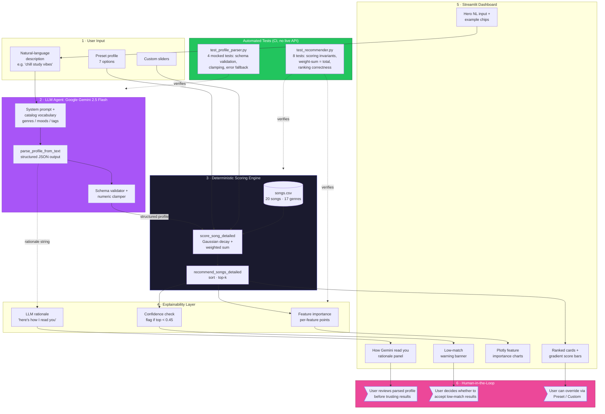
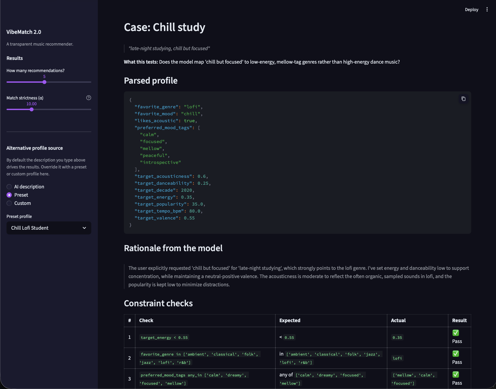

# 🎵 VibeMatch 2.0 - A Transparent Music Recommender

VibeMatch 2.0 is a content-based music recommender where you describe how you're feeling in plain English and get back ranked songs, each with a visible reason for its score. A Google Gemini LLM reads your description and turns it into a structured taste profile, a deterministic scoring engine ranks the 20 songs in the catalog, and a Streamlit dashboard exposes exactly which features drove each ranking. The design principle I kept coming back to: **the LLM is a translator, not the thing picking your songs**. That way every recommendation is still explainable in code I can read and audit.


---

## Demo Video

I recorded a short walk-through showing the natural language input, the feature importance charts, and the Reliability tab in action.

**[Watch the demo on Google Drive](https://drive.google.com/drive/folders/1xE5cfaO5ShMCWQEJnQGuNiVSEofKd8mG?usp=sharing)**

---

## Original Project: VibeMatch 1.0

The starter version of this, which I called **VibeMatch 1.0**, was the project I built for **AI110 Module 3** (*Music Recommender Simulation*). It was a command line tool on top of a 20-song CSV catalog. The scoring logic used Gaussian decay on numeric features (energy, valence, danceability, and a few others) plus binary matching on genre and mood, with seven pre-written user profiles for testing. The model card I wrote for it flagged a problem right at the start:

> *"A system can look like it's working when it's really just defaulting to whatever the data has the most of."*

Out of 20 songs, 3 were lofi and most other genres only had 1 song each. That quote stuck with me and it's basically why I built VibeMatch 2.0 the way I did. I wanted the system to show its work so the user could tell the difference between "this actually matches you" and "this just happens to be in the catalog."

---

## What's New in 2.0

- A Streamlit dashboard replacing the CLI, with the natural language input as the hero feature
- Per-feature importance charts (Plotly) on every recommendation, with hover tooltips showing exactly how much each feature contributed to the score
- A natural language profile builder powered by Gemini 2.5 Flash. Type "I want something warm and unhurried" and it gets turned into a structured profile the scorer can consume.
- Confidence badges on every result card (Strong / Moderate / Weak), plus a ranking confidence summary above the list that reflects how tightly clustered the top scores are
- An evaluation harness (`scripts/evaluate_parser.py`) that runs a hand-written set of known prompts through live Gemini and checks each parsed profile against assertions
- A Reliability tab inside the dashboard that renders the latest evaluation report inline, so the evidence that the LLM is working sits next to the feature and not buried somewhere in the repo

---

## Architecture Overview



The system is six components in a pipeline, with a check at each boundary:

1. **User Input** - three ways in: natural language description, one of the 7 presets, or custom sliders. The text box is the default experience.
2. **LLM Agent (Gemini 2.5 Flash)** - reads the description and returns a structured `UserProfile` JSON. The genre and mood fields are restricted to enum lists pulled from the catalog, so Gemini can't invent a genre that doesn't exist. It also returns a short rationale explaining what it picked.
3. **Deterministic Scoring Engine** - the same Gaussian-decay logic from VibeMatch 1.0. The actual song picking happens here, not in the LLM.
4. **Explainability Layer** - breaks every score into 10 per-feature contributions for the charts, fires a warning if the top score is under 0.45, and keeps Gemini's rationale so the user can see it.
5. **Streamlit Dashboard** - the hero NL input at the top, result cards with score bars and confidence badges, expandable feature importance charts, and the Reliability tab.
6. **Human-in-the-Loop** - the "How Gemini read you" panel lets the user see the parsed profile before trusting the results. If it looks wrong they can always switch to preset or custom.

Supporting tables (components at a glance, every verification checkpoint with code references, and the responsible-AI design note) live in [assets/system_diagram.md](assets/system_diagram.md). The scoring pipeline diagram from the starter is at [assets/flowchart.md](assets/flowchart.md).

---

## Setup Instructions

### Prerequisites

- Python 3.10 or later
- A free Google Gemini API key from [aistudio.google.com/apikey](https://aistudio.google.com/apikey). The free tier for `gemini-2.5-flash` is **5 requests per minute**, which is enough for demo use but worth knowing before running the evaluation harness.

### Install and run

```bash
# Clone the repo
git clone https://github.com/Ammugera/andrewmuriithi-applied-ai-system-project
cd andrewmuriithi-applied-ai-system-project

# Create an isolated environment
python -m venv venv
source venv/bin/activate     # Windows: venv\Scripts\activate

# Install dependencies
pip install -r requirements.txt

# Add your Gemini API key
cp .env.example .env
# Open .env and paste your key after GEMINI_API_KEY=

# Launch the dashboard
streamlit run src/app.py
```

The dashboard opens at [http://localhost:8501](http://localhost:8501).

### What happens without an API key?

If you don't set `GEMINI_API_KEY`, the natural language input gets disabled with a message telling you why. The **Preset** and **Custom** profile sources keep working. The dashboard doesn't crash on a missing key. I wanted that to be a graceful fallback.

### Alternate entry points

```bash
# Classic CLI runner (the original VibeMatch 1.0 interface)
python -m src.main

# Run the unit test suite (12 tests, no live API calls)
pytest tests/ -v

# Regenerate the reliability report by running the golden set
# against live Gemini (takes about 2 minutes because of 5 RPM pacing)
python -m scripts.evaluate_parser
```

---

## Sample Interactions

Every example below is real output from Gemini 2.5 Flash, quoted verbatim from [assets/reliability_report.md](assets/reliability_report.md). That file has all 8 cases from the evaluation harness with pass/fail per constraint.


### Example 1 - An easy one

**Input:**

> *"Sunday morning coffee and journaling, slow and acoustic"*

**Parsed profile:**

| Field | Value |
|---|---|
| favorite_genre | `folk` |
| favorite_mood | `peaceful` |
| target_energy | `0.25` |
| target_acousticness | `0.95` |
| target_valence | `0.75` |
| target_decade | `2020` |

**Gemini's rationale:**

> *"The description 'Sunday morning coffee and journaling, slow and acoustic' strongly suggests a peaceful and relaxed mood. I've set high acousticness and low energy/danceability to match the 'slow and acoustic' preference. The preferred mood tags reflect the calm and introspective nature of journaling."*

Gemini grabbed the obvious cues (*slow*, *acoustic*) and pushed them to the extremes (acousticness 0.95, energy 0.25) but kept valence positive. A relaxed morning vibe, not a sad one.

---

### Example 2 - A harder one

**Input:**

> *"calm but not sleepy, an evening wind-down after work"*

**Parsed profile:**

| Field | Value |
|---|---|
| favorite_genre | `lofi` |
| favorite_mood | `relaxed` |
| target_energy | `0.45` |
| target_acousticness | `0.60` |
| target_valence | `0.65` |
| target_decade | `2020` |

**Gemini's rationale:**

> *"The request for 'calm but not sleepy' suggests a relaxed, low-energy vibe that isn't completely static, leading to a moderate energy and danceability. 'Evening wind-down' points to a peaceful and mellow mood, with a slightly positive valence. Lofi is a suitable genre for this specific combination of traits."*

This one is more interesting. "Calm" pushes energy down, but "not sleepy" pushes it back up a little. Gemini landed at 0.45, which felt right, and actually explained the trade-off in the rationale. This is the kind of reasoning I was hoping for when I decided to use the LLM as a translator instead of a decision maker.

---

### Example 3 - A contradiction on purpose

**Input:**

> *"I want something both extremely calm and extremely loud at the same time"*

**Parsed profile:**

| Field | Value |
|---|---|
| favorite_genre | `ambient` |
| favorite_mood | `peaceful` |
| target_energy | `0.25` |
| target_valence | `0.55` |
| target_acousticness | `0.30` |

**Gemini's rationale:**

> *"The request for 'extremely calm and extremely loud' presents a contradiction. I've interpreted 'calm' as low energy and peaceful, while 'loud' is understood as a full, immersive soundscape that can be experienced at high volume, rather than high energy or aggression. Ambient music is chosen as it can provide a serene atmosphere with rich, expansive sound textures."*

I was honestly surprised by this one. I expected the model to either pick one side of the contradiction or split the difference at 0.5 on every field. Instead it named the contradiction out loud and reasoned its way to ambient music, where "loud" makes sense as "rich soundscape" rather than "high energy." This is what I was hoping for when I added the adversarial case to the evaluation set.

> See [assets/reliability_report.md](assets/reliability_report.md) for all 8 golden-set cases with pass/fail per constraint.


*A single case rendered inside the Reliability tab: the parsed profile JSON, Gemini's rationale, and the constraint table with pass/fail per row.*

---

## Design Decisions

Every bigger architectural choice involved a trade-off. These are the ones I think are worth calling out.

**Using the LLM only as a translator.** I could have asked Gemini to pick songs directly, but then I couldn't explain any individual recommendation. By limiting it to "turn English into a structured profile," every ranking stays in code I wrote and can test. The cost is that the system can't reason creatively about music the way a pure-LLM setup could. For a class project about responsible AI, auditability was worth more to me than that flexibility.

**Schema-constrained output with enum grounding.** I passed Gemini a JSON schema with the genre and mood fields locked to enum lists pulled from the catalog at import time. That means it literally cannot return a genre that doesn't exist in my data. Cost: the Gemini SDK's Schema type didn't play nicely with integer enums, so for `target_decade` I ended up relying on a system prompt instruction plus a runtime check instead of a hard schema constraint.

**Clamping numeric values after parsing.** If Gemini ever returns `target_energy = 1.5`, I clamp it to 1.0 and emit a `UserWarning`. The trade-off is that clamping silently changes the profile, but I wanted that change to show up in logs rather than stay hidden.

**Plotly instead of matplotlib for the feature charts.** Plotly gives you interactive hover tooltips, which I thought were important for the XAI story (you can hover on "Energy" and see `0.253 pts (weight 4.0 × raw 0.98 / 15.5)`). The cost is one extra dependency.

**Gemini 2.5 Flash instead of OpenAI or Claude.** Gemini is the only one of the three with a truly free tier that supports structured JSON output. The trade-off showed up immediately: the free tier is capped at 5 requests per minute, which I'll come back to in the testing section.

**Hand-written assertions instead of LLM-as-judge.** For the reliability harness I could have used another LLM call to grade the output. Instead I wrote explicit assertions like "target_energy must be < 0.55 for the chill-study case." It's cheaper, faster, and the results are falsifiable. The cost is that subtler quality issues (tone, creativity, whether the rationale reads well) aren't checked at all. The assertions also end up doubling as documentation of what "good" output looks like.

---

## Testing Summary

### What worked

- **12/12 unit tests pass** in under a second. 8 of them cover the scoring engine, including `test_feature_weights_sum_to_total`, which checks that the per-feature values on every chart actually add up to the displayed total score. 4 cover the LLM parser with mocked responses, so they run in CI without needing an API key. Files: [tests/test_recommender.py](tests/test_recommender.py) and [tests/test_profile_parser.py](tests/test_profile_parser.py).
- **18/18 reliability constraints pass** when I run the golden set against live Gemini. The generated report is at [assets/reliability_report.md](assets/reliability_report.md).
- **Streamlit starts cleanly.** No tracebacks, HTTP 200, and the feature importance charts render for all 7 preset profiles.

### What didn't work the first time

- **Two of my modules disagreed about imports.** While I was building the parser and the app in parallel, one of them used `from profiles import ...` and the other used `from src.profiles import ...`. The app imported fine on startup but crashed the moment I clicked "Find my vibe" and it tried to lazy-import the parser. I fixed it by prepending the repo root to `sys.path` at the top of `app.py` and using `from src.*` everywhere.
- **I was wrong about Gemini's free tier rate limit.** I thought it was 15 requests per minute. It's 5. The first time I ran the evaluation harness, calls 7 and 8 came back `429 RESOURCE_EXHAUSTED`. I added a 13-second sleep between calls, which made a full run take about 2 minutes.
- **The "80s retro" test case failed the first run, but for an interesting reason.** The catalog's `KNOWN_DECADES` list is `[1990, 2000, 2010, 2020]`. There is no 1980 in the data. Forced to pick from the list, Gemini went with 2010 and said in its rationale that it was picking that decade for "synthwave's resurgence." The failure was really about my catalog, not the LLM. I relaxed the assertion to `target_decade <= 2010`, which matches reality. This is exactly the kind of problem the harness is supposed to surface.

### What I learned

- **The evaluation harness paid off the first time I ran it.** It caught the catalog decade bias right away, and that's a class of issue my unit tests would never have found.
- **Integration smoke tests (just running the app and hitting it with curl) caught bugs that passed every unit test.** The import mismatch above is the best example.
- **Rate limits are a design constraint, not an afterthought.** If I had been thinking about 5 RPM from the start I would have built the pacing in from day one.

---

## Reflection

VibeMatch 2.0 shows how I approach AI engineering. I started with a plain command line music recommender I built for AI110 Module 3 and asked what would make it trustworthy to use, not just functional. Adapting it meant adding a Streamlit dashboard, feature importance charts that explain every score, and a Gemini powered natural language profile builder. The decision I'm proudest of is keeping the LLM as a translator rather than a decision maker, so the ranking stays deterministic and auditable. I think that says I care more about AI systems that show their work than ones that look clever.

### Limitations and biases

The system inherits every bias from VibeMatch 1.0's catalog and adds a few new ones on top. The catalog itself is 20 songs with lofi dominating at three entries and most other genres holding only one, so any user whose taste falls outside the well-represented genres will see weaker matches by construction. Decade coverage is also uneven: there are no 1970s or 1980s songs, which is exactly why the evaluation harness caught Gemini picking 2010 for an "80s retro" prompt. The LLM itself brings its own assumptions. Gemini's training data skews toward Western, English-language music culture, so its mappings of qualitative cues like "calm" or "upbeat" to specific genres reflect those norms more than any universal truth. There's also no personalization loop: every session starts from scratch, so the system can't learn that a given user actually prefers folk to what it led with last time.

### Could this be misused?

A music recommender is low-stakes on its own, but two risks are worth flagging. First, anything typed into the natural language box is sent to Google Gemini's free tier, where the terms of service allow inputs and outputs to be used to improve the model. Someone typing emotionally specific context (*"I just got dumped and want something to cry to"*) should know that, which is why the UI carries a small disclosure note next to the input. Second, and more significant: the architecture pattern here (an LLM translates language into a structured profile, a deterministic engine makes the final decision) would be easy to copy into higher-stakes domains like content moderation or loan pre-qualification. The same design can hide real harm if someone strips out the transparency layers I built in, meaning the rationale panel, the feature importance charts, and the reliability report. So the defense is really the transparency, not the architecture itself.

### What surprised me in reliability testing

Two things. The first was how thoughtfully Gemini handled the "80s retro" case. I expected a rigid "pick something from the enum list" response. Instead it picked 2010 and explicitly wrote *"synthwave's resurgence"* in its rationale to explain why. That level of self-awareness about the constraint was not something I expected, and it changed how I wrote the test: I loosened the assertion to match catalog reality instead of treating the model's behavior as a failure. The second surprise was the adversarial contradiction case. I had assumed Gemini would either refuse, pick one side, or return something bland in the middle. Instead it named the contradiction in its rationale and reasoned its way to ambient music by redefining "loud" as "rich soundscape" rather than "high energy." Both results made me more confident that keeping the LLM in the translator role was the right call.

### Collaborating with AI on this project

I used Claude (Anthropic's coding assistant) to pair-program through most of this build, and it's worth being honest about where that helped and where it misled me.

**One helpful suggestion.** When I asked for a reliability system, Claude suggested a golden-set evaluation harness with declarative constraints (field, operator, expected value, rationale) instead of just adding more unit tests. That was a better idea than what I would have done on my own. The declarative structure made the markdown report fall out naturally, and when the 80s retro case failed on the first live run, the constraint table made the problem obvious in about thirty seconds.

**One flawed suggestion.** When I was picking a free LLM API, Claude told me Gemini 2.5 Flash's free tier was 15 requests per minute. It's actually 5. I didn't catch the mistake until the first full harness run, when calls seven and eight came back with `429 RESOURCE_EXHAUSTED`. I had to go back and add 13-second pacing between calls. The fix was small but the lesson was bigger: even when an AI assistant sounds confident about a specific number, it's worth verifying against the provider's actual docs before building around it.

---

## Repo Tour

| Path | What's in it |
|---|---|
| [src/app.py](src/app.py) | Streamlit dashboard: hero NL input, result cards, feature-importance charts, Reliability tab |
| [src/recommender.py](src/recommender.py) | Deterministic scoring engine, `score_song_detailed`, and the `Recommender` OOP class |
| [src/profile_parser.py](src/profile_parser.py) | Gemini-backed natural language to `UserProfile` parser with schema validation and clamping |
| [src/profiles.py](src/profiles.py) | 7 preset profiles and `KNOWN_GENRES` / `KNOWN_MOODS` / `KNOWN_MOOD_TAGS` derived from the catalog |
| [src/main.py](src/main.py) | Classic CLI runner preserved from VibeMatch 1.0 |
| [scripts/evaluate_parser.py](scripts/evaluate_parser.py) | LLM evaluation harness: golden set, assertion runner, markdown report writer |
| [tests/](tests/) | 12 automated tests (scorer invariants plus mocked parser tests) |
| [assets/system_diagram.md](assets/system_diagram.md) | Full Mermaid system diagram with verification-point tables |
| [assets/flowchart.md](assets/flowchart.md) | Scoring-pipeline diagram from the VibeMatch 1.0 starter |
| [assets/reliability_report.md](assets/reliability_report.md) | Latest golden-set evaluation report |
| [model_card.md](model_card.md) | Bias analysis and limitations from VibeMatch 1.0 |
| [requirements.txt](requirements.txt) | `streamlit`, `plotly`, `google-genai`, `python-dotenv`, `pandas`, `pytest` |

---

## Screenshots

| | |
|---|---|
|  |  |
| Natural language hero input with example chips | Result card with feature importance chart expanded |
|  |  |
| Reliability tab: summary of all 8 golden-set cases | Reliability tab: detail view of a single case |

*(PNGs added separately. Take them with the dashboard running at `streamlit run src/app.py`.)*
