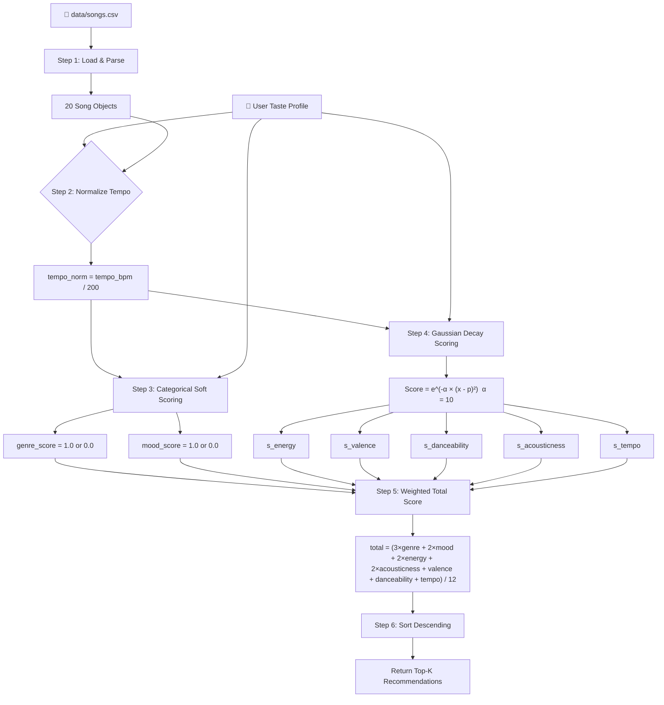

```mermaid
flowchart TD
    A[📄 data/songs.csv] --> B[Step 1: Load & Parse]
    B --> C[20 Song Objects]

    D[👤 User Taste Profile] --> E{Step 2: Normalize Tempo}
    C --> E
    E --> F[tempo_norm = tempo_bpm / 200]

    F --> G[Step 3: Categorical Soft Scoring]
    D --> G
    G --> H[genre_score = 1.0 or 0.0]
    G --> I[mood_score = 1.0 or 0.0]

    F --> J[Step 4: Gaussian Decay Scoring]
    D --> J
    J --> K["Score = e^(-α × (x - p)²)  α = 10"]
    K --> L[s_energy]
    K --> M[s_valence]
    K --> N[s_danceability]
    K --> O[s_acousticness]
    K --> P[s_tempo]

    H --> Q[Step 5: Weighted Total Score]
    I --> Q
    L --> Q
    M --> Q
    N --> Q
    O --> Q
    P --> Q
    Q --> R["total = (3×genre + 2×mood + 2×energy + 2×acousticness + valence + danceability + tempo) / 12"]

    R --> S[Step 6: Sort Descending]
    S --> T[Return Top-K Recommendations]
```
