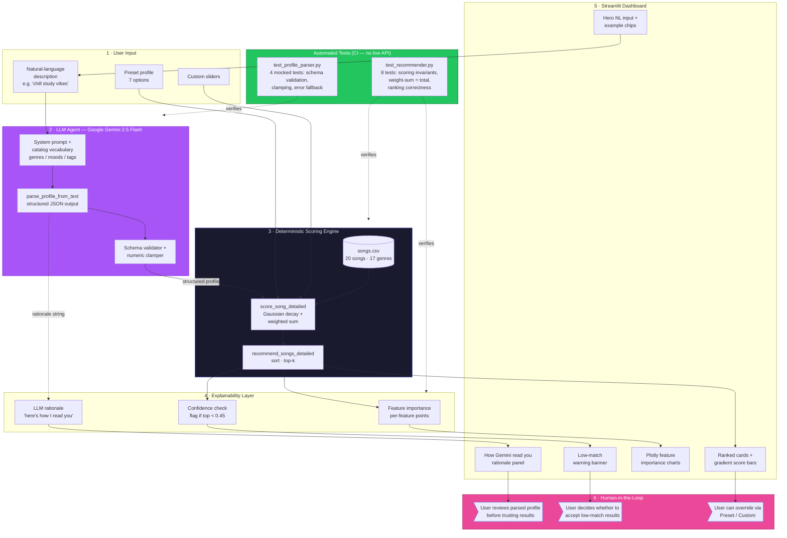

# VibeMatch 2.0 — System Diagram

High-level view of how the system is organized, where data flows, and where
humans or tests verify AI output.

---



---

## Components at a glance

| # | Component | Role |
|---|---|---|
| 1 | **User Input** | Three paths: plain-English description (primary), preset profile, custom sliders |
| 2 | **LLM Agent** (Gemini 2.5 Flash) | Translates natural language → structured `UserProfile` via schema-constrained JSON output. **Not a decision-maker** — only a translator |
| 3 | **Scoring Engine** | Fully deterministic Gaussian-decay scoring with weighted categorical matching. Every score is reproducible and auditable |
| 4 | **Explainability Layer** | Decomposes each score into per-feature contributions, surfaces the LLM's own rationale, flags low-confidence results |
| 5 | **Streamlit Dashboard** | Renders rationale panel, ranked cards with gradient score bars, Plotly feature-importance charts with hover tooltips |
| 6 | **Human-in-the-Loop** | User reviews the LLM's interpretation, decides whether a warning applies, and can always override |

---

## Data flow (primary path)

```
User types "chill study vibes"
      ↓
LLM Agent parses into structured profile + rationale
      ↓
Validator clamps out-of-range numerics, warns on clamp
      ↓
Deterministic scorer ranks all 20 songs
      ↓
Feature-importance explainer decomposes each score
      ↓
Dashboard shows rationale panel + ranked cards + charts
      ↓
User reads rationale, inspects feature bars, decides to trust or override
```

---

## Where AI output is verified

| Check | Where | Example |
|---|---|---|
| **Schema conformance** | `parse_profile_from_text` — enum constraints on `favorite_genre`, `favorite_mood`, `preferred_mood_tags` | LLM cannot return `"favorite_genre": "k-pop"` because k-pop isn't in `KNOWN_GENRES` |
| **Numeric range clamping** | `profile_parser._clamp_profile` | If LLM returns `target_energy=1.5`, it's clamped to `1.0` and a `UserWarning` is emitted |
| **Error fallback** | `ProfileParseError` wraps every SDK exception | Missing API key → user sees *"GEMINI_API_KEY not set"*, not a stack trace; preset/custom paths still work |
| **Transparency panel** | `_render_parsed_profile_panel` | *"How Gemini read you"* shows the parsed values + rationale, so the user sees the LLM's interpretation before the results |
| **Confidence warning** | `_render_results` | If top score < 0.45: *"⚠️ No strong matches — the catalog may not serve this taste profile well"* |
| **Scoring invariants** | `tests/test_recommender.py` | `test_feature_weights_sum_to_total` — every feature-importance chart must sum to the displayed score |
| **Parser invariants** | `tests/test_profile_parser.py` | `test_out_of_range_values_clamped` — feeds a mocked response with `energy=1.5`, asserts clamp + warning |
| **User override** | Sidebar radio | User can always switch to Preset or Custom if the LLM's interpretation feels wrong |

---

## Responsible-AI design principle: the LLM is the front door, not the judge

The LLM *only* translates language into structured fields. It never:

- picks songs directly
- assigns scores
- overrides the deterministic ranker

This means every recommendation is explainable, reproducible, and auditable
via the feature-importance charts — the LLM's role is limited to the
natural-language front door.
